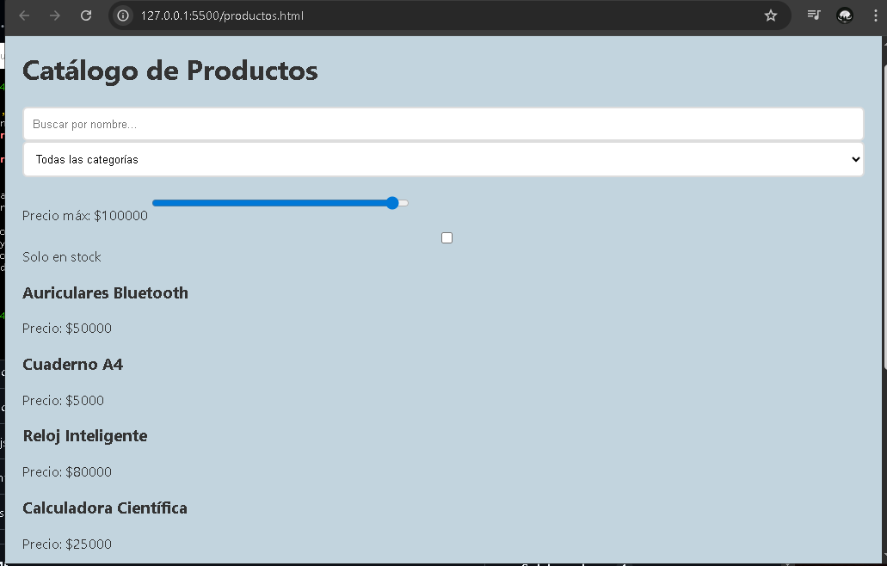
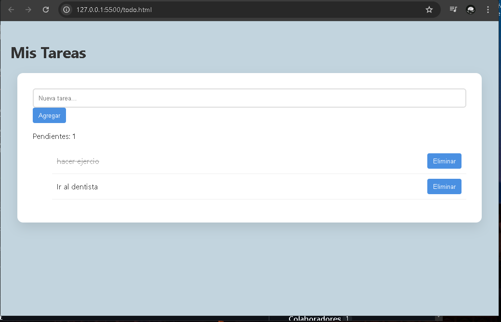
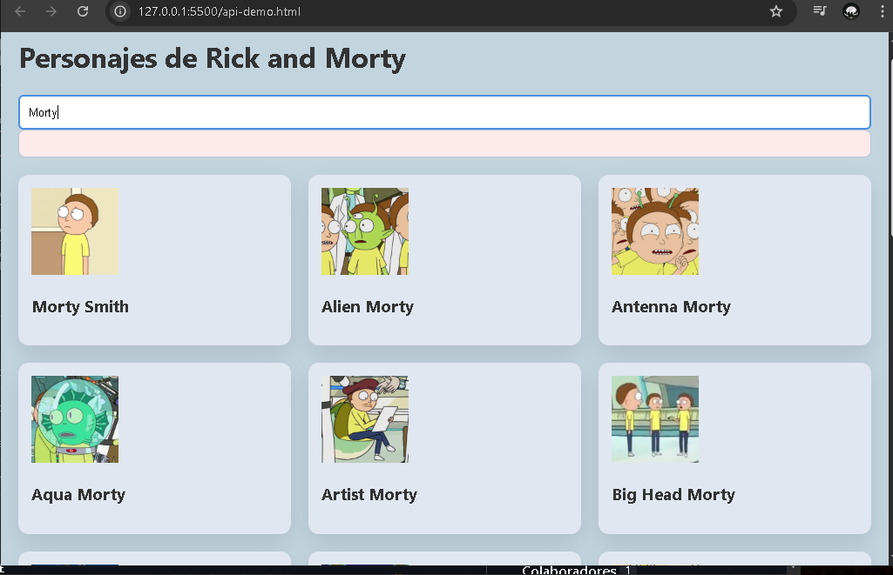
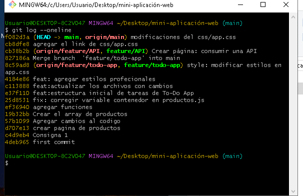

Proyecto Integrador: JavaScript 
Este proyecto consiste en una aplicación web multipágina desarrollada para practicar lógica de programación, manipulación del DOM y consumo de APIs.

Funcionalidades:
Catálogo de productos: Sistema de filtrado por categoría, precio y nombre.
Lista de tareas: Aplicación para gestionar tareas con funciones de agregar, completar y eliminar.
Buscador de API: Consumo de datos externos con manejo de estados de carga y errores.

Tecnologías Usadas:
HTML5
CSS3 (Flexbox/Grid, Variables CSS)
JavaScript ES6+ (Async/Await, Fetch API, Rick and Morty(personajes)) 

Link de repo :https://github.com/ValeriaLaguna99/mini-aplicacion-web.git
 

 Capturas de pantallas de las páginas:
 
 
 
 

